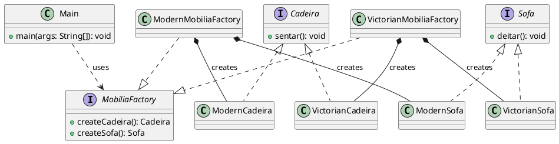

# Abstract Factory - Java Design Pattern

## O que é o Abstract Factory?

O padrão Abstract Factory é um padrão de criação que fornece uma interface para criar famílias de objetos relacionados sem especificar suas classes concretas. Ele permite que o cliente produza objetos de diferentes famílias de produtos de forma intercambiável, garantindo que os objetos criados sejam compatíveis entre si.

# Diagrama de Classes

## Material de apoio

https://refactoring.guru/pt-br/design-patterns/abstract-factory
