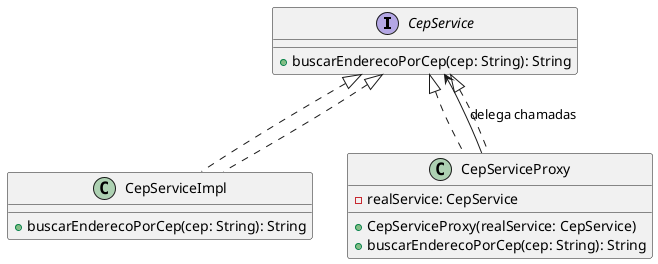
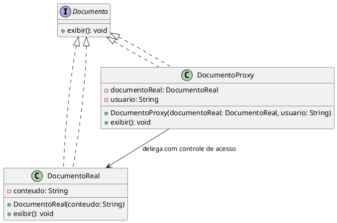

# Proxy - Java Design Pattern

## O que é o Proxy?

O padrão Proxy fornece um **substituto ou representante** de outro objeto para controlar o acesso a ele. Ele é útil para adicionar funcionalidades como **caching, logging, autenticação, fallback ou controle de acesso**, sem alterar a lógica da implementação real.

---

## Exemplo 1: Integração com serviço externo (CEP)

Neste exemplo, simulamos a chamada a um serviço de busca de endereço via CEP. O proxy é responsável por:

- Interceptar a chamada real
- Registrar logs
- Implementar lógica de fallback em caso de falha

### Componentes:

- `CepService`: Interface que define a operação `buscarEnderecoPorCep`.
- `CepServiceImpl`: Simula a chamada real ao serviço externo.
- `CepServiceProxy`: Implementa a lógica de proxy com controle de erro e fallback.

### Exemplo de uso:

```java
CepService real = new CepServiceImpl();
CepService proxy = new CepServiceProxy(real);

String resultado = proxy.buscarEnderecoPorCep("66000-000");
System.out.println(resultado);
```

## Diagrama de classe 




## EExemplo 2: Controle de acesso a documentos

Neste segundo exemplo, usamos o proxy para restringir o acesso a documentos com base no usuário.


### Componentes:

- `Documento`: Interface que define a operação exibir().
- `DocumentoReal`: Implementação real com o conteúdo do documento.
- `DocumentoProxy`: Controla o acesso, permitindo apenas usuários autorizados.

### Exemplo de uso:

```java
Documento doc1 = new DocumentoProxy(new DocumentoReal("Segredo TOP"), "admin");
doc1.exibir(); // Acesso permitido

Documento doc2 = new DocumentoProxy(new DocumentoReal("Segredo TOP"), "convidado");
doc2.exibir(); // Acesso negado
```

## Diagrama de classe 


